# Conv2Crypt
## Cryptography with Convolution

this is a new way to secure your data. 

Advantages of conv2crypt : 
- it is possible to have many matrices and the convolution of them with the same kernel / key gives us the same result. so we can store data in different forms.
- it is possble to make a kernel / key with different size. 

Disanvantages : 
- the last index of the kernel / key can not be zero.

so the only rule of it is the last index of the kernel / key can not be zero.

## Implimentation : 

We take the letters and let the numbers 0 to 25 represent them.
and after Encrypt or Decrypt we take the lettters back.

Since the algorithm is based on convolution , have a quick look on it :   

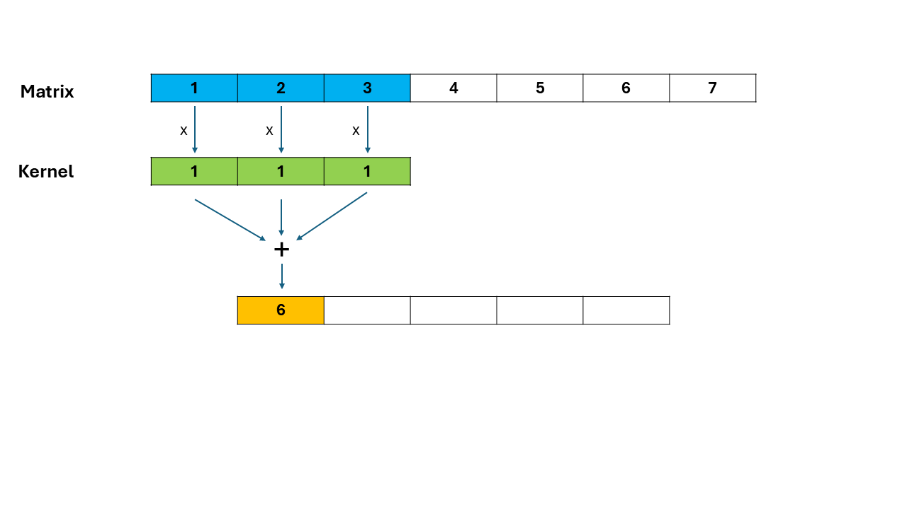
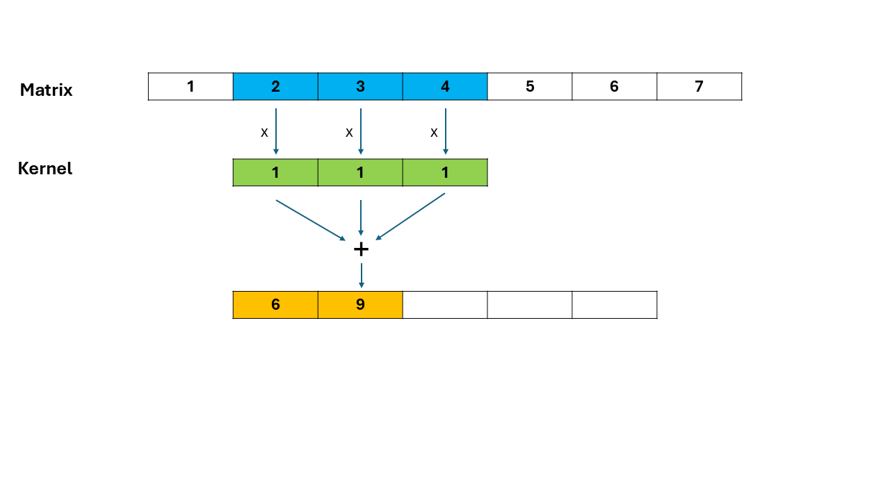
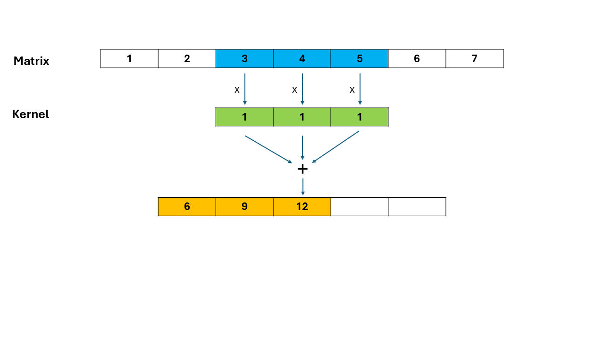
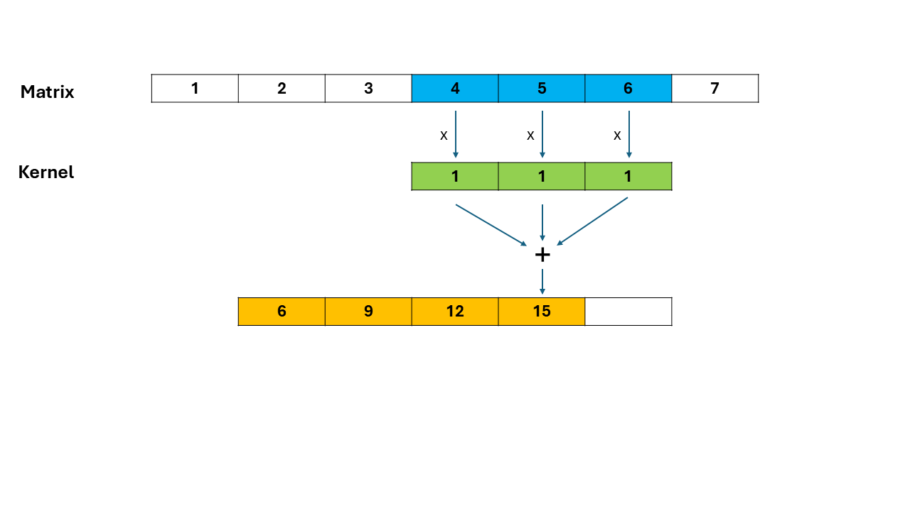
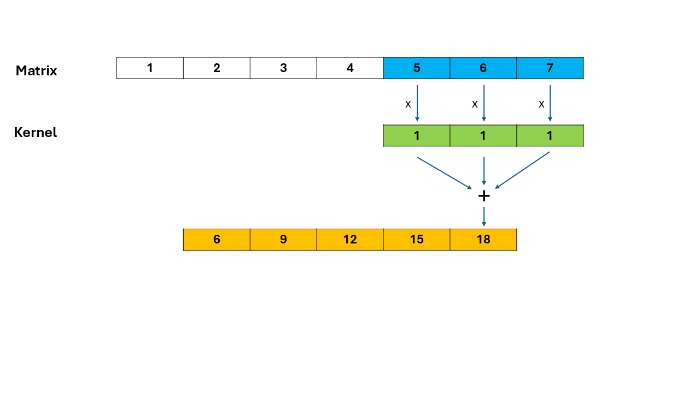

The advantage of convolution is IRREVERSIBLE , because you can not guess the operands from the sum unlike the multiplication.
So we put the convolution as the Decryption function. and write an Encryption algorithm for it.

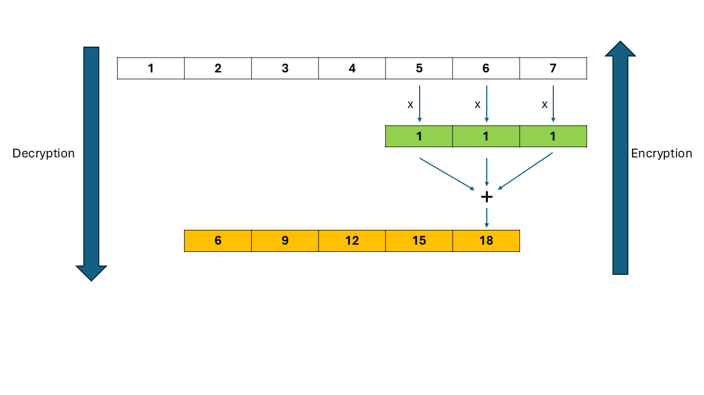
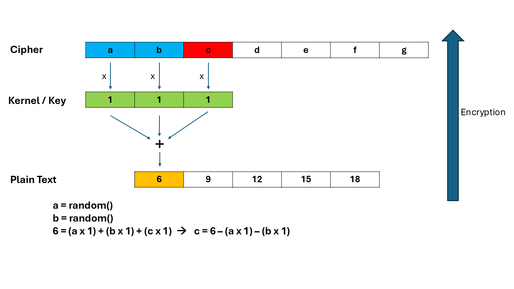
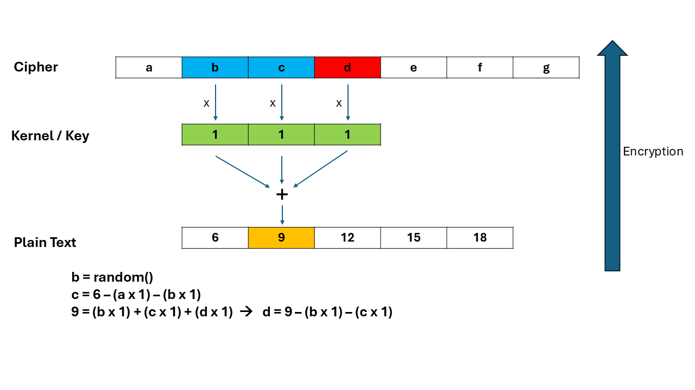
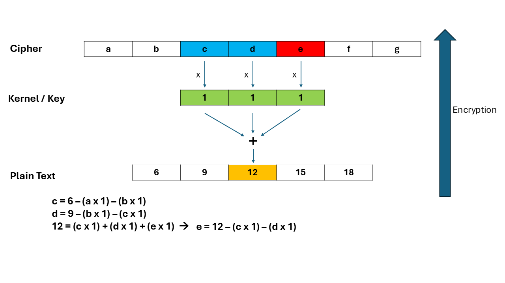
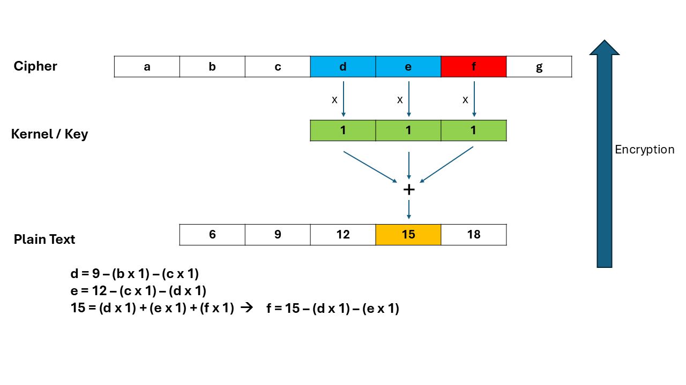
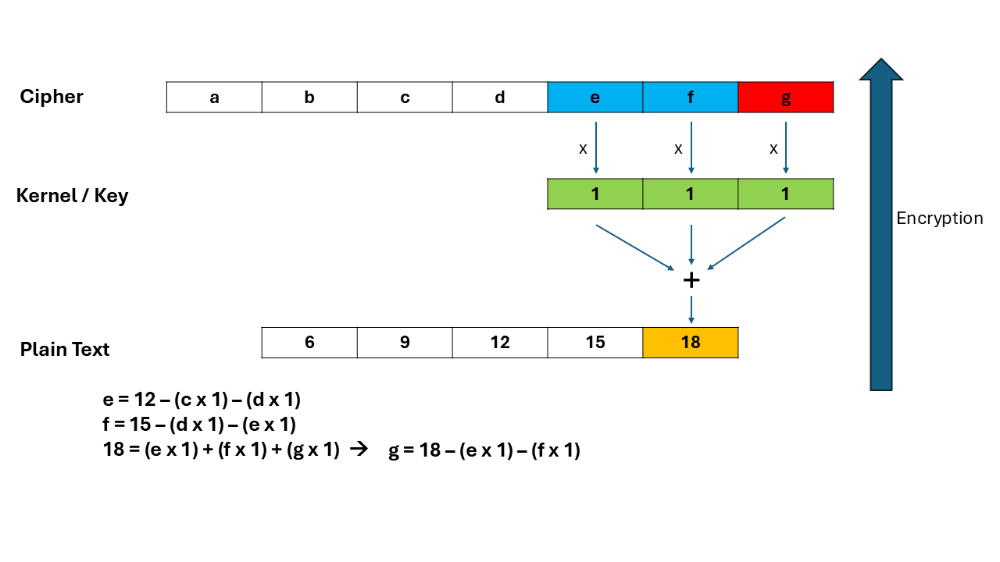

So far we considered the kernel is [ 1 , 1 , 1 , ...] to show it simple , and now with the general form it may contain any number.
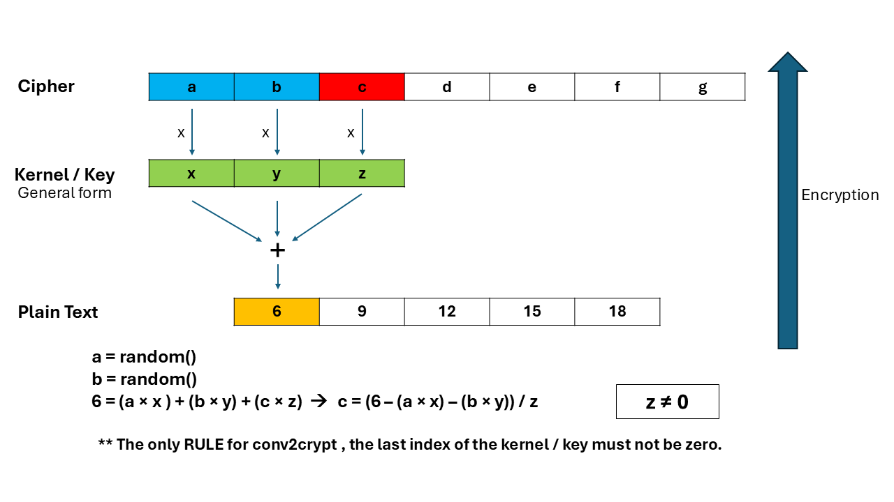
